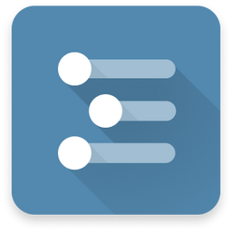

# electron-builder [](https://www.npmjs.com/package/electron-builder) [](https://yarn.pm/electron-builder)
A complete solution to package and build a ready for distribution [Electron](https://electronjs.org), [Proton Native](https://proton-native.js.org/) app for macOS, Windows and Linux with “auto update” support out of the box. 📦

Always looking for community contributions! 👀 Setting up a [dev environment](https://github.com/electron-userland/electron-builder/blob/master/CONTRIBUTING.md) is easy to do 🪩

## Sponsors

<table>
   <tr align="center">
      <td>
         <a href="https://workflowy.com">
            <div>
               
            </div>
            Notes, Tasks, Projects.<br>All in a Single Place.
         </a>
         <br>
      </td>
   </tr>
   <tr align="center">
      <td>
         <br>
         <a href="https://tidepool.org">
            <div>
               
            </div>
            Your gateway to understanding your diabetes data
         </a>
         <br>
      </td>
      <td>
         <br>
         <a href="https://keygen.sh/?via=electron-builder">
            <div>
               
            </div>
            An open, source-available software licensing and distribution API
         </a>
         <br>
      </td>
   </tr>
   <tr align="center">
      <td>
         <br>
         <a href="https://www.todesktop.com/electron?utm_source=electron-builder">
            <div>
               
            </div>
            ToDesktop: An all-in-one platform for building and releasing Electron apps
         </a>
         <br>
      </td>
      <td>
         <br>
         <a href="https://www.dashcam.io/?ref=electron_builder">
            <div>
               
            </div>
            Dashcam: Capture the steps to reproduce any bug with video crash reports for Electron.
         </a>
         <br>
      </td>
   </tr>
</table>


## Documentation

See the full documentation on [electron.build](https://www.electron.build).

* NPM packages management:
    * [Native application dependencies](https://electron.atom.io/docs/tutorial/using-native-node-modules/) compilation (including [Yarn](http://yarnpkg.com/) support).
    * Development dependencies are never included. You don't need to ignore them explicitly.
    * [Two package.json structure](https://www.electron.build/docs/tutorials/two-package-structure) is supported, but you are not forced to use it even if you have native production dependencies.
* [Code Signing](https://www.electron.build/docs/features/code-signing/code-signing) on a CI server or development machine.
* [Auto Update](https://www.electron.build/docs/features/auto-update) ready application packaging.
* Numerous target formats:
    * All platforms: `7z`, `zip`, `tar.xz`, `tar.7z`, `tar.lz`, `tar.gz`, `tar.bz2`, `dir` (unpacked directory).
    * [macOS](https://www.electron.build/docs/mac): `dmg`, `pkg`, `mas`.
    * [Linux](https://www.electron.build/docs/linux): [AppImage](http://appimage.org), [snap](http://snapcraft.io), debian package (`deb`), `rpm`, `freebsd`, `pacman`, `p5p`, `apk`.
    * [Windows](https://www.electron.build/docs/win): `nsis` (Installer), `nsis-web` (Web installer), `portable` (portable app without installation), AppX (Windows Store), MSI, Squirrel.Windows.
* [Publishing artifacts](https://www.electron.build/docs/publish) to GitHub Releases, Amazon S3, DigitalOcean Spaces and Bintray.
* Advanced building:
    * Pack in a distributable format (already packaged app).
    * Separate [build steps](https://github.com/electron-userland/electron-builder/issues/1102#issuecomment-271845854).
    * Build and publish in parallel, using hard links on CI server to reduce IO and disk space usage.
* [Docker](https://www.electron.build/docs/features/multi-platform-build#docker) images to build Electron app for Linux or Windows on any platform.
* Downloads all required tool files on demand automatically (e.g., to code sign a Windows application, to make AppX), no setup required.

| Question                               | Answer                                                                            |
| -------------------------------------- | --------------------------------------------------------------------------------- |
| “I want to configure electron-builder” | [See options](https://www.electron.build/docs/configuration)                 |
| “I found a bug or I have a question”   | [Open an issue](https://github.com/electron-userland/electron-builder/issues/new) |
| “I want to support development”        | [Donate](https://www.electron.build/docs/donate)                                       |

## Requirements

**Node.js >=22.12.0** is required for v27.

> **⚠️ Upgrading from v26?** v27 is a major release with breaking changes (native ESM, Node >=22.12, and removed deprecated APIs). **Read the breaking changes before upgrading:** [electron.build/docs/migration/v27-breaking-changes](https://www.electron.build/docs/migration/v27-breaking-changes)
>
> Then run the automated migration command — it rewrites your config in place:
> ```bash
> electron-builder migrate-schema
> ```
> Step-by-step walkthrough: **[v26 → v27 migration guide](./MIGRATION.md)** · [electron.build/docs/migration/v26-to-v27](https://www.electron.build/docs/migration/v26-to-v27)

## Installation
```
yarn add electron-builder --dev
// or npm, pnpm, bun
```

### Note for Yarn 3

Yarn 3 uses PnP by default, but electron-builder still needs node-modules (ref: [yarnpkg/berry#4804](https://github.com/yarnpkg/berry/issues/4804#issuecomment-1234407305)). Add configuration in the `.yarnrc.yaml` as follows:
```
nodeLinker: "node-modules"
```
This instructs Yarn to use node-modules instead of PnP.

## Quick Setup Guide

[electron-quick-start](https://github.com/electron/electron-quick-start) is the official minimal starter for a new Electron application.

1. Clone the starter and add electron-builder:
    ```bash
    git clone https://github.com/electron/electron-quick-start
    cd electron-quick-start
    npm install
    npm install electron-builder --save-dev
    ```

2. Specify the standard fields in the application `package.json` — `name`, `description`, `version` and [author](https://docs.npmjs.com/files/package.json#people-fields-author-contributors).

3. Specify the [build](https://www.electron.build/docs/configuration) configuration in the `package.json` as follows:
    ```json
    "build": {
      "appId": "your.id",
      "mac": {
        "category": "your.app.category.type"
      }
    }
    ```
   See [all options](https://www.electron.build/docs/configuration). Option [files](https://www.electron.build/docs/contents#files) to indicate which files should be packed in the final application, including the entry file, maybe required.
   You can also use separate configuration files, such as `js`, `ts`, `yml`, and `json`/`json5`. See [read-config-file](https://www.npmjs.com/package/read-config-file) for supported extensions. [JS Example for programmatic API](https://www.electron.build/docs/programmatic-usage)

4. Add [icons](https://www.electron.build/docs/features/icons).

5. Add the [scripts](https://docs.npmjs.com/cli/run-script) key to the development `package.json`:
    ```json
    "scripts": {
      "app:dir": "electron-builder --dir",
      "app:dist": "electron-builder"
    }
    ```
    Then you can run `yarn app:dist` (to package in a distributable format (e.g. dmg, windows installer, deb package)) or `yarn app:dir` (only generates the package directory without really packaging it. This is useful for testing purposes).

    To ensure your native dependencies are always matched electron version, simply add script `"postinstall": "electron-builder install-app-deps"` to your `package.json`.

6. If you have native addons of your own that are part of the application (not as a dependency), set [nodeGypRebuild](https://www.electron.build/docs/configuration) to `true`.

Please note that everything is packaged into an asar archive [by default](https://www.electron.build/docs/configuration).

For an app that will be shipped to production, you should sign your application. See [Where to buy code signing certificates](https://www.electron.build/docs/features/code-signing/code-signing#where-to-buy-code-signing-certificate).

## Programmatic Usage
TypeScript types are provided and can be found [here](https://www.electron.build/docs/api/index). See the full [programmatic usage guide](https://www.electron.build/docs/programmatic-usage).

```js
// ESM (recommended)
import { build, Platform } from "electron-builder"

await build({
  targets: Platform.MAC.createTarget(),
  config: {
    // build options — see https://www.electron.build/
  }
})
```

```js
// CommonJS — also works on Node >=22.12.0
const { build, Platform } = require("electron-builder")

build({ targets: Platform.MAC.createTarget(), config: {} })
  .then(() => { /* done */ })
  .catch(console.error)
```

## Community Boilerplates

* [electron-react-boilerplate](https://github.com/chentsulin/electron-react-boilerplate) A boilerplate for scalable cross-platform desktop apps.
* [electron-vue-vite](https://github.com/caoxiemeihao/electron-vue-vite) A real simple Electron + Vue3 + Vite5 boilerplate.
* [vite-electron-builder](https://github.com/cawa-93/vite-electron-builder) Secure boilerplate for Electron app based on Vite. Supports multiple frameworks.
* [electronjs-with-nextjs](https://github.com/saulotarsobc/electronjs-with-nextjs) ElectronJS application with NextJS and TypeScript.

## Debug

Set the `DEBUG` environment variable to debug what electron-builder is doing:
```bash
DEBUG=electron-builder
```

`FPM_DEBUG` env to add more details about building linux targets (except snap and appimage).

`DEBUG_DMG=true` env var to add more debugging/verbosity from `hdiutil` (macOS).

:::tip[Windows cmd]
On [Windows](https://github.com/visionmedia/debug#windows-command-prompt-notes) the environment variable is set using the set command.
```bash
set DEBUG=electron-builder
```
:::

:::tip[PowerShell]
PowerShell uses different syntax to set environment variables.
```bash
$env:DEBUG = "electron-builder"
```
:::

If you've identified a bug and want to report it, use [electron/minimal-repro](https://github.com/electron/minimal-repro) to create a minimal reproduction case. Attaching one to your issue significantly speeds up diagnosis.

## Donate

This open source work is accomplished during free time. If you'd like to have more time invested in it, please consider [donating](https://www.electron.build/docs/donate).
